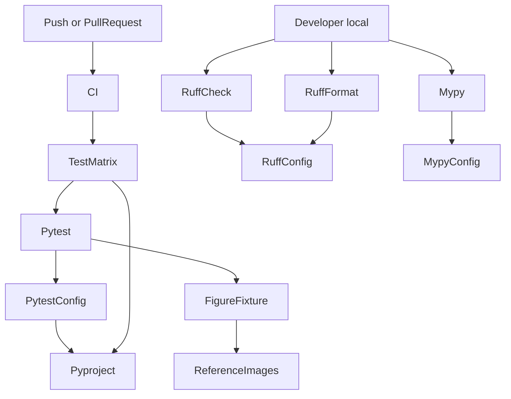
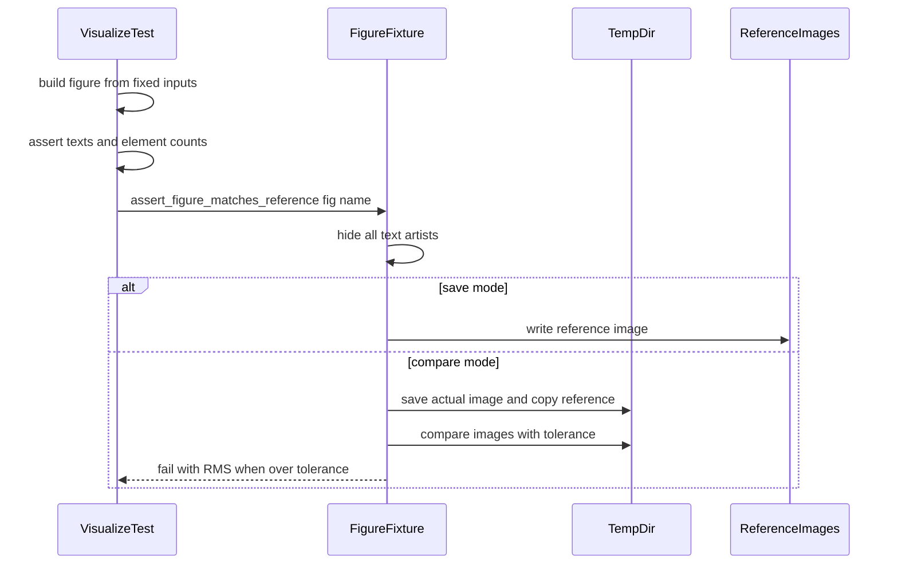

# Design Document: dev-foundation

## Overview
**Purpose**: yikit の作者が、変更のたびにテストを Python の各版で自動で確かめ、書式・静的検査・型を手元で確かめられるようにし、古い Python（3.8）の環境の利用者にも yikit を届ける。
**Users**: yikit の作者（開発とレビュー）、Python 3.8 を含む古い環境で yikit を使う利用者（licond など）。後に続く spec（module-quality、optuna-tuning、ensemble-on-sklearn）と gbdt-fix は、この土台の上で進める。
**Impact**: CI は「Python 3.9〜3.14 で pytest」から「Python 3.8〜3.14 で pytest」になる。ruff と mypy は手元で実行し、規則と対象を設定ファイルで固定する。パッケージ全体の型注釈が新しい書き方に揃い、依存の宣言が実際に動く範囲に合う。main で失敗している画像比較のテストが、依存の版に左右されなくなる。公開 API の振る舞いは変えない。

### Goals
- CI で pytest が Python 3.8〜3.14 のすべてで通る
- 手元で ruff（静的検査・書式）と mypy がエラー 0 件で通る
- パッケージ全体の型注釈が `from __future__ import annotations` と新しい書き方に揃い、mypy のエラーが 0 件
- 依存の宣言（Python の版、Boruta、optuna、optuna-integration、extra）が実際に動く範囲と一致する
- 画像比較のテストが依存の版で揺れず、リポジトリを汚さない

### Non-Goals
- 依存の下限の組み合わせでの動作の保証（作者の判断で範囲外）
- 新しいテストの追加と docstring の英語化（module-quality、各 spec）
- モデルの振る舞いの変更（optuna-tuning、ensemble-on-sklearn、gbdt-fix）
- ruff の bugbear（B）や docstring（D）の規則の導入
- CI での ruff・mypy の実行（作者の判断で手元だけにする）

## Boundary Commitments

### This Spec Owns
- CI の定義（`.github/workflows/CI.yml`）: 起動の条件と、Python の版ごとのテストのジョブ
- パッケージの宣言（`pyproject.toml`）: `requires-python`、classifiers、依存と extra の範囲、pytest の設定
- 静的検査と型検査の設定（`ruff.toml`、`mypy.ini`）
- dependabot の設定（`.github/dependabot.yml`）と、開いている dependabot の PR（#25、#26）の後始末
- `src/yikit` のすべてのモジュールの型注釈の書き方と、Python 3.8 で動かない書き方の解消（振る舞いを変えない機械的な変更）
- 画像比較の仕組み（`tests/conftest.py` の fixture と pytest の引数）と、`tests/test_visualize.py` の図のテスト、`tests/imgs/` の参照画像
- テストでの `OptunaSearchCV` の import 元

### Out of Boundary
- 公開 API の追加・削除・名前や既定値の変更
- `src/yikit` の docstring の内容（module-quality と各 spec）
- `test_visualize.py` 以外のテストの追加（既存のテストを 3.8 と新しい import で動かすための最小限の変更は持つ）
- docs の生成（`docs.yml`、Sphinx の設定）とリリースの手順（`release-pypi.yml`）
- EnsembleRegressor の `np.bool` など、テストで使われていないモデルの不具合（ensemble-on-sklearn、gbdt-fix）

### Allowed Dependencies
- GitHub Actions（`actions/checkout`、`actions/setup-python`）と ubuntu-latest の Python 3.8〜3.14
- 開発用の道具: ruff（0.16 以上）、mypy（2.4 以上）は手元で使う。pytest は手元と CI で使う
- 依存の範囲: 必須の依存の下限は変えない。optional の依存は Boruta>=0.4.3、optuna>=3.0、optuna-integration（下限なし）
- テストは matplotlib の公開されたテスト用の道具（`matplotlib.testing.compare.compare_images`）を使う

### Revalidation Triggers
- ruff の `select` や `target-version` を変えたとき: すべての spec のコードが新しい規則で通るか確かめる
- `requires-python` を 3.9 以上に戻したとき（2.5）: 各 spec の「Python 3.8 でも動く書き方」の制約を外してよいか見直す
- 画像比較の fixture の呼び出し方を変えたとき: module-quality の図のテストが影響を受ける
- optional の依存の範囲を変えたとき: optuna-tuning と ensemble-on-sklearn の import と使う API を確かめる

## Architecture

### Existing Architecture Analysis
- CI は `test` ジョブ 1 つで、Python 3.9〜3.14 の行列、`fail-fast` は既定（有効）。`pytest -xs .` をリポジトリの最上位で実行している
- `ruff.toml` は `select` を持たないので、ruff の版によって規則が変わる。`mypy.ini` は `ignore_missing_imports = True` だけ
- `pyproject.toml` に pytest の設定はない。`test` の extra に `optuna-integration[sklearn]` がある
- 画像比較は `tests/test_visualize.py` の中の関数で行い、参照画像は `python tests/test_visualize.py` で作る

### Architecture Pattern & Boundary Map



**Architecture Integration**:
- Selected pattern: CI はテストの行列（7 版）だけを持ち、版ごとの依存の違いを確かめる。静的検査・書式・型検査は版に依存しないので、手元で設定ファイルに従って実行する
- Domain/feature boundaries: 設定（pyproject、ruff、mypy、dependabot）、CI、コードの書き換え、図のテストの仕組み、の4つに分かれ、互いのファイルを共有しない。ruff と mypy は設定だけを持ち、実行は手元で行う
- Existing patterns preserved: src レイアウト、`[test,optional]` の extra で CI に入れる方式、`tests/imgs/` の参照画像
- New components rationale: 画像比較の fixture は、図のテストが増えても（module-quality）同じ比べ方を使えるようにするため
- Steering compliance: tech.md の型の決まり（future import、3.8 でも動く書き方）、依存の下限の方針

### Technology Stack

| Layer | Choice / Version | Role in Feature | Notes |
|-------|------------------|-----------------|-------|
| CI | GitHub Actions、ubuntu-latest、`actions/setup-python@v5` | テストの実行 | 3.8.18 は ubuntu-24.04 でも入手できる |
| Lint / Format（手元） | ruff 0.16 以上 | 静的検査、書式、型注釈の自動書き換え | `select` を明示し、`target-version = "py38"` |
| Type check（手元） | mypy 2.4 以上 | `src/yikit` の型検査 | 対象版は指定しない（3.10 未満を指定できないため） |
| Test | pytest、`matplotlib.testing.compare` | テストの実行と画像の比較 | |
| Runtime | Python 3.8〜3.14 | 対応する版 | 3.8 で失敗が解消できなければ 3.9〜 に戻す |

## File Structure Plan

### Modified Files
- `pyproject.toml` — `[build-system]` を `setuptools>=61` に下げ、`license` を表の形（`{ text = "Apache-2.0" }`）に戻して `license-files` を消す（Python 3.8 でもソースからビルドできるように）。`requires-python = ">=3.8"`、classifiers に 3.8、optional の依存を `Boruta>=0.4.3`・`optuna>=3.0`・`optuna-integration` に、`test` の extra を `pytest` だけに、`dev` の extra に `ruff`・`mypy`、`[tool.pytest.ini_options]` に `testpaths = ["tests"]`
- `ruff.toml` — `target-version = "py38"`、`extend-exclude = ["examples", "docs_src"]`、`[lint] select`、`[lint.isort] required-imports`
- `mypy.ini` — `files = src/yikit` を追加
- `.github/workflows/CI.yml` — `test` ジョブを 3.8〜3.14・`fail-fast: false`・`pytest -ra` に（ruff・mypy のジョブは加えない）
- `.github/dependabot.yml` — `versioning-strategy: increase-if-necessary`
- `src/yikit/**/*.py` — `from __future__ import annotations` の追加、注釈の書き換え、3.8 未満向けの分岐の削除、mypy のエラー 3 件の解消、選んだ規則の残りの違反の修正（振る舞いは変えない）
- `tests/conftest.py` — 画像比較の fixture `assert_figure_matches_reference` と pytest の引数 `--save-reference-figures`
- `tests/test_visualize.py` — 図の入力を固定の値から作る、文字の内容と要素の数を値で比べる、比較は fixture を使う、`__main__` での参照画像の保存をやめる
- `tests/test_optuna.py` — `OptunaSearchCV` を `optuna_integration` から import し、なければ `optuna.integration` から import する
- `tests/imgs/*.png` — 文字を除いた参照画像に作り直す（5 枚、ファイル名は変えない）
- `tests/test_boruta.py`・`tests/test_filtermethod.py` — future import の追加などの機械的な変更のみ。3.8 で値の違いによる失敗が出た場合だけ、research.md の方針で検査を置き換える

## System Flows



- 文字の内容は、画像を比べる前にテストの中で値として確かめる（6.4）。画像の比較は文字を消した後に行う（6.5）
- 差分の画像は一時ディレクトリの中にしか作られない（6.2）

## Requirements Traceability

| Requirement | Summary | Components | Interfaces | Flows |
|-------------|---------|------------|------------|-------|
| 1.1 | 3.8〜3.14 でのテスト | CIWorkflow、PackagingConfig | `pip install ".[test,optional]"`、`pytest -ra` | — |
| 1.2 | 版の失敗で他を止めない | CIWorkflow | `strategy.fail-fast: false` | — |
| 1.3 | どれかが失敗したら全体を失敗に | CIWorkflow | ジョブの終了コード | — |
| 1.4 | 設定や依存の変更でも CI を起動 | CIWorkflow | `on.push.paths`、`on.pull_request.paths` | — |
| 2.1 | 3.8 以上を宣言 | PackagingConfig | `requires-python` | — |
| 2.2 | classifiers に 3.8〜3.14 | PackagingConfig | classifiers | — |
| 2.3 | 3.8 で import してもエラーにならない | TypingSweep、CIWorkflow | future import | — |
| 2.4 | 3.14 では ngboost なしで動く | PackagingConfig | 既存の marker を維持 | — |
| 2.5 | 3.8 を通せなければ 3.9 に戻す | PackagingConfig、TypingSweep | 判断の手順（research.md に記録） | — |
| 3.1 | 新しい注釈の書き方 | TypingSweep、LintConfig | UP006・UP007・UP045、I002 | — |
| 3.2 | 古い typing を使わない | TypingSweep、LintConfig | UP035、UP006 | — |
| 3.3 | 3.8 で注釈を評価してもエラーにならない | TypingSweep | future import、FA102 | — |
| 3.4 | mypy のエラー 0 件 | TypingSweep、LintConfig | `mypy` | — |
| 3.5 | 書き換えで振る舞いを変えない | TypingSweep | 既存のテスト | — |
| 4.1 | Boruta>=0.4.3 | PackagingConfig | `optional` の extra | — |
| 4.2 | optuna>=3.0 | PackagingConfig | `optional` の extra | — |
| 4.3 | optuna-integration を optional に | PackagingConfig | `optional` の extra | — |
| 4.4 | 他の下限を上げない | PackagingConfig | 依存の宣言 | — |
| 4.5 | dev の extra に ruff・mypy | PackagingConfig | `dev` の extra | — |
| 4.6 | `OptunaSearchCV` の import 元の切り替え | OptunaImportInTests | try/except ImportError | — |
| 4.7 | 非推奨の警告を出さない | OptunaImportInTests | `optuna_integration` から import | — |
| 5.1 | 範囲内の新しい版では PR を作らない | DependabotConfig | `versioning-strategy` | — |
| 5.2 | 範囲外なら広げる PR | DependabotConfig | `versioning-strategy` | — |
| 5.3 | #25・#26 を閉じる | DependabotConfig | `gh pr close` とコメント | — |
| 6.1 | tests だけを集める | PackagingConfig | `testpaths` | — |
| 6.2 | 出力を一時ディレクトリに | FigureFixture | `assert_figure_matches_reference` | 図の比較 |
| 6.3 | 全版で図のテストが通る | FigureFixture、VisualizeTests、CIWorkflow | 許容値 | 図の比較 |
| 6.4 | 内容が変われば失敗 | VisualizeTests、FigureFixture | 文字と要素の数の比較、文字を除いた画像の比較 | 図の比較 |
| 6.5 | 描画の細かな違いでは失敗しない | FigureFixture、VisualizeTests | 文字を消す、固定の入力 | 図の比較 |
| 6.6 | 検査の対象を減らさない | VisualizeTests | 5 つの図のテストを維持 | — |
| 7.1 | 公開 API を変えない | TypingSweep | — | — |
| 7.2 | 同じ入力・種で同じ結果 | TypingSweep | 既存のテスト | — |
| 7.3 | 振る舞いを変える修正は承認を得る | TypingSweep | 判断の手順 | — |
| 8.1 | 手元の ruff がエラー 0 件 | LintConfig、TypingSweep | `ruff check src tests`、`ruff format --check src tests` | — |
| 8.2 | examples を対象外に | LintConfig | `extend-exclude` | — |
| 8.3 | 規則を明示して固定 | LintConfig | `[lint] select` | — |

## Components and Interfaces

| Component | Domain/Layer | Intent | Req Coverage | Key Dependencies (P0/P1) | Contracts |
|-----------|--------------|--------|--------------|--------------------------|-----------|
| PackagingConfig | 設定 | パッケージの宣言と pytest の設定 | 1.1, 2.1, 2.2, 2.4, 2.5, 4.1–4.5, 6.1 | pip（P0） | State |
| LintConfig | 設定 | 手元で使う ruff と mypy の規則と対象 | 3.1–3.4, 8.1–8.3 | ruff（P0）、mypy（P0） | State |
| CIWorkflow | CI | テストの実行と報告 | 1.1–1.4, 2.3, 6.3 | GitHub Actions（P0） | Batch |
| DependabotConfig | CI | 依存の更新 PR の方針 | 5.1–5.3 | dependabot（P1） | State |
| TypingSweep | コード | 型注釈の書き換えと 3.8 対策 | 2.3, 2.5, 3.1–3.5, 7.1–7.3, 8.1 | LintConfig（P0） | — |
| FigureFixture | テスト | 文字を除いた画像の比較と参照画像の保存 | 6.2–6.5 | matplotlib.testing（P0） | Service |
| VisualizeTests | テスト | 5 つの図のテストを固定の入力で行う | 6.3–6.6 | FigureFixture（P0）、yikit.visualize（P0） | — |
| OptunaImportInTests | テスト | `OptunaSearchCV` の import 元の切り替え | 4.6, 4.7 | optuna-integration（P1） | — |

### 設定

#### PackagingConfig

| Field | Detail |
|-------|--------|
| Intent | `pyproject.toml` の依存・extra・Python の版・pytest の設定を、実際に動く範囲に合わせる |
| Requirements | 1.1, 2.1, 2.2, 2.4, 2.5, 4.1, 4.2, 4.3, 4.4, 4.5, 6.1 |

**Responsibilities & Constraints**
- `requires-python = ">=3.8"`。classifiers は 3.8〜3.14
- `[build-system] requires = ["setuptools>=61"]`。`license = { text = "Apache-2.0" }` にし、`license-files` は消す（LICENSE は setuptools が既定で同梱する）。setuptools 77.0.3 以上は Python 3.9 以上を要求し、3.8 で入る setuptools（75.3.x）は PEP 639 の書き方（`license = "Apache-2.0"`、`license-files`）を受け付けないため
- 必須の依存（scikit-learn>=0.24.1 など）は変えない
- `optional`: `Boruta>=0.4.3`、`optuna>=3.0`、`optuna-integration` を追加。ngboost の marker（`python_version < '3.14'`）はそのまま
- `test`: `pytest`（`optuna-integration` は `optional` に移す）
- `dev`: 既存の `build`・`jupytext` に `ruff`・`mypy` を加える
- `[tool.pytest.ini_options]`: `testpaths = ["tests"]`。最上位で `pytest` を実行しても `examples/` は集めない

**Contracts**: State [x]
- 宣言の不変条件: 下限を上げてよいのは Boruta と optuna だけ（4.4）

**Implementation Notes**
- Validation: CI の全版で `pip install ".[test,optional]"` が通る。3.8 では pip が `requires_python` を見て古い版を選ぶ
- Risks: 3.8 で入らない依存があれば、その依存に marker を付ける。それでも通せなければ 2.5 に従う
- Risks: 新しい setuptools は表の形の `license` に「2027-02-18 までに直す」という非推奨の警告を出す。その後の setuptools でビルドが失敗するおそれがあるので、期限の前に（遅くとも 1.0.0 で 3.8 を外すときに）PEP 639 の書き方へ戻す

#### LintConfig

| Field | Detail |
|-------|--------|
| Intent | 手元で使う ruff の規則と対象、mypy の対象を固定する |
| Requirements | 3.1, 3.2, 3.3, 3.4, 8.1, 8.2, 8.3 |

**Responsibilities & Constraints**
- `ruff.toml`
  - `target-version = "py38"`、`line-length = 79`（既存）
  - `extend-exclude = ["examples", "docs_src"]`
  - `[lint] select = ["E4", "E7", "E9", "F", "W", "I", "UP", "FA"]`、`unfixable = ["F401"]`（既存）
  - `[lint.isort] required-imports = ["from __future__ import annotations"]`
  - `[lint.pydocstyle] convention = "numpy"`（既存。D は選ばないので、今は効かない）
- `mypy.ini`: `files = src/yikit`、`ignore_missing_imports = True`（既存）。対象の版は書かない

**Contracts**: State [x]

**Implementation Notes**
- Risks: ruff の新しい版で、選んだ規則の中に新しい検査が入ることがある。手元で違反が増えたら、規則を直すか ruff の版を確かめる

### CI

#### CIWorkflow

| Field | Detail |
|-------|--------|
| Intent | push と pull request でテストを走らせ、結果を版ごとに報告する |
| Requirements | 1.1, 1.2, 1.3, 1.4, 2.3, 6.3 |

**Contracts**: Batch [x]

##### Batch / Job Contract
- Trigger: main への push、pull request（opened・synchronize・reopened・ready_for_review）、`workflow_dispatch`。パスの条件は既存のもの（`pyproject.toml`、`tests/**`、`src/**`、`CI.yml` など）を保つ
- ruff・mypy のジョブは置かない（手元で実行する）
- `test` ジョブ: `python-version` は 3.8〜3.14、`fail-fast: false`。`pip install ".[test,optional]"` の後に `pytest -ra`
- Output: 版ごとのジョブの成否。どれかが失敗すれば workflow 全体が失敗（1.3）
- Idempotency & recovery: 同じコミットで再実行しても同じ結果になる（テストは固定の種と固定の入力）

**Implementation Notes**
- Validation: PR を出す前に、`gh workflow run CI.yml --ref <branch>` で全版の結果と画像比較の RMS を確かめる
- Risks: 3.8 の runner が将来なくなる。その場合は 2.5 と同じ判断をする

#### DependabotConfig

| Field | Detail |
|-------|--------|
| Intent | 宣言の範囲内の新しい版では PR を作らないようにする |
| Requirements | 5.1, 5.2, 5.3 |

**Contracts**: State [x]
- `.github/dependabot.yml` の pip の項目に `versioning-strategy: increase-if-necessary` を加える。他の項目（週ごと、prefix、PR の上限）は変えない
- #25（setuptools）と #26（Boruta）は、この spec の PR が main に入った後に、理由を書いたコメントを付けて閉じる。#26 の下限の変更は PackagingConfig で取り込む

### コード

#### TypingSweep

| Field | Detail |
|-------|--------|
| Intent | `src/yikit` と `tests` の型注釈を新しい書き方に揃え、3.8 で動かない書き方をなくす |
| Requirements | 2.3, 2.5, 3.1, 3.2, 3.3, 3.4, 3.5, 7.1, 7.2, 7.3 |

**Responsibilities & Constraints**
- すべてのモジュールの先頭に `from __future__ import annotations`（ruff の I002 で自動追加）
- 注釈を `X | None`・組み込みの型のジェネリクスへ書き換える（UP006・UP007・UP045 の自動修正）。`typing` の `Optional`・`Union`・`List`・`Dict`・`Tuple`・`Set`・`Type` の import を消す
- `sys.version_info >= (3, 8)` の分岐を、3.8 以上の側だけにする（UP036）。`Literal` は `typing` から import する
- 実行時に評価される場所（`isinstance`、関数の外の式、`TypeVar` の bound など）では、PEP 585/604 の書き方を使わない
- mypy のエラー（`_optuna.py` の dict-item、`_yyplot.py` の arg-type 2 件）は、注釈を正すか、値の型を明示して直す。計算は変えない
- 公開 API の名前・引数・既定値・返り値は変えない（7.1）

**Implementation Notes**
- Integration: 自動修正のコミットと、手での修正のコミットを分ける
- Validation: 書き換えの前後で、手元（3.12）の既存のテスト（`test_boruta`、`test_filtermethod`、`test_optuna`）が同じ結果で通る（7.2）。3.8 での import は CI で確かめる
- Risks: 3.8 で値の違いによるテストの失敗が出たら、research.md の「値を固定で比べるテストが 3.8 で失敗した場合の扱い」に従う。コードの振る舞いを変える必要が出たら、作者の承認を得る（7.3）

### テスト

#### FigureFixture

| Field | Detail |
|-------|--------|
| Intent | 図を、文字を除いた画像として参照画像と比べる。参照画像の作り直しもここで行う |
| Requirements | 6.2, 6.3, 6.4, 6.5 |

**Contracts**: Service [x]

##### Service Interface
```python
# tests/conftest.py
def pytest_addoption(parser: pytest.Parser) -> None:
    """Add ``--save-reference-figures`` to regenerate reference images."""

@pytest.fixture
def assert_figure_matches_reference(
    request: pytest.FixtureRequest, tmp_path: Path
) -> Callable[[Figure, str], None]:
    """Return a checker that compares ``fig`` with ``tests/imgs/<name>``."""
```
- Preconditions: `fig` は matplotlib の Figure。`name` は `tests/imgs/` の中のファイル名（`.png`）
- Postconditions:
  - 図のすべての文字（タイトル、軸のラベル、目盛り、凡例の文字）を見えなくしてから保存する
  - 保存のモード（`--save-reference-figures`）では、`tests/imgs/<name>` を書き換える
  - 比較のモードでは、実際の図と参照画像を `tmp_path` に置いて比べる。RMS が許容値を超えたら、RMS の値と一時ファイルの場所を含む AssertionError で失敗する。参照画像がなければ、作り直しの方法を含むメッセージで失敗する
  - リポジトリの中には何も書かない（保存のモードを除く）
  - 図は閉じる
- Invariants: dpi は固定（36、既存）。許容値は1つの定数で、CI の全版の RMS をもとに決める（research.md に記録）

**Implementation Notes**
- Risks: 文字を除いても、線の描き方の違いで RMS が出る。CI の全版で測ってから許容値を決める

#### VisualizeTests

| Field | Detail |
|-------|--------|
| Intent | 5 つの図のテストを、モデルの学習に頼らない固定の入力で行う |
| Requirements | 6.3, 6.4, 6.5, 6.6 |

**Responsibilities & Constraints**
- 対象は今と同じ 5 つの図（`SummarizePI`、`get_dist_figure`、`get_learning_curve_optuna`、`get_learning_curve_gb` の NGBoost と LightGBM）。参照画像のファイル名も変えない（6.6）
- 入力
  - SummarizePI: 種を固定した乱数で作った重要度の DataFrame
  - get_learning_curve_optuna: 固定の値の試行を `add_trial` した study
  - get_dist_figure: 固定の値から作った ngboost の分布
  - get_learning_curve_gb（NGBoost）: 固定の `evals_result` を持つ NGBRegressor
  - get_learning_curve_gb（LightGBM）: 小さな固定のデータで、決定的な設定で学習した LGBMRegressor
- 各テストは、画像の比較の前に、図の文字（タイトル、軸のラベル、凡例）と要素の数（軸、線など）を値で確かめる（6.4）
- ngboost を使うテストは、今と同じく Python 3.14 以上では skip する

**Implementation Notes**
- Risks: LightGBM の学習曲線が版によって揺れた場合は、学習済みの判定を通る形で固定の `evals_result` を与える

#### OptunaImportInTests

| Field | Detail |
|-------|--------|
| Intent | `OptunaSearchCV` を新しい場所から import し、古い環境では元の場所を使う |
| Requirements | 4.6, 4.7 |

- `tests/test_optuna.py` で `from optuna_integration import OptunaSearchCV` を試し、`ImportError` なら `from optuna.integration import OptunaSearchCV` を使う

## Error Handling

### Error Strategy
- CI: テストの失敗をそのままジョブの失敗にする。テストの行列は `fail-fast: false` で、すべての版の結果を残す
- 画像比較: 失敗のメッセージに RMS の値、許容値、一時ファイルの場所、参照画像の作り直しの方法を含める
- 3.8 での失敗: コードの不具合なら直す。依存の版による数値の違いなら、research.md の方針でテストを置き換える。直せなければ作者に相談し、2.5 に従う

## Testing Strategy

### 検査の仕組みの確認
- 画像比較 fixture: 同じ図なら通る。線を1本足した図や、線の値を変えた図では失敗する。失敗しても `tests/imgs/` に新しいファイルができない（6.2、6.4）
- 画像比較 fixture: 文字だけを変えた図（タイトルやフォント）は、画像の比較では失敗しない（6.5）。文字の内容は各テストの値の比較で検出する
- 保存のモード: `--save-reference-figures` で `tests/imgs/` の画像が作り直され、続けて比較のモードで通る

### 既存のテストの維持
- `test_boruta`・`test_filtermethod`・`test_optuna` が、型の書き換えの前後で同じ結果で通る（3.12、7.2）
- `test_optuna` が `OptunaSearchCV` の非推奨の警告を出さない（`-W error::FutureWarning` 相当の確認、4.7）

### CI での確認
- Python 3.8〜3.14 の全版で `pytest` が通る（1.1〜1.3、2.3、6.3）

### 手元での確認
- `ruff check src tests`、`ruff format --check src tests`、`mypy` がエラー 0 件（3.4、8.1）
- Python 3.8 で yikit と各サブパッケージを import できる（2.3）

## Migration Strategy
- 参照画像は文字を除いた形に作り直すので、既存の参照画像とは中身が変わる。ファイル名は変えない
- 3.8 を通せなかった場合の戻し方: `requires-python` と classifiers を 3.9 以上に戻し、CI の行列から 3.8 を外し、ruff の `target-version` を `py39` にする。理由を research.md に記録し、release-0.4.0 の変更履歴に書く
