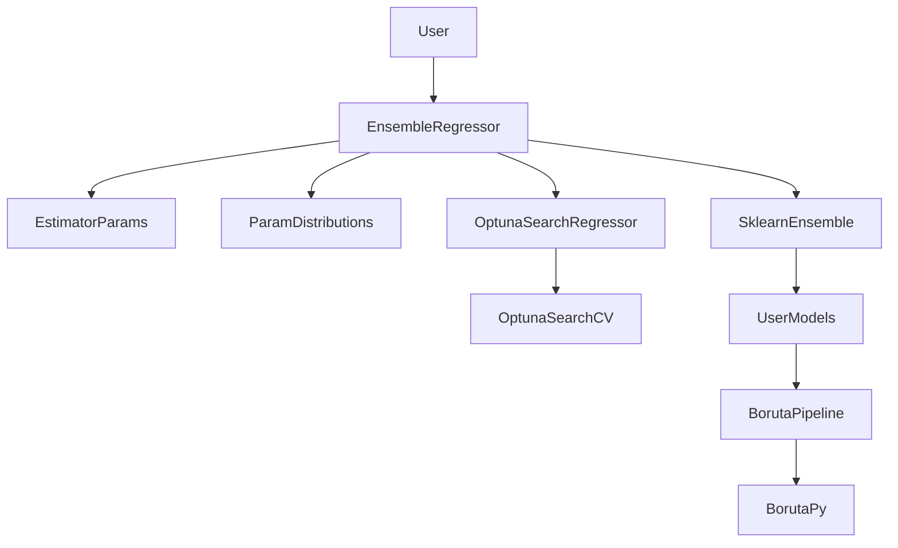
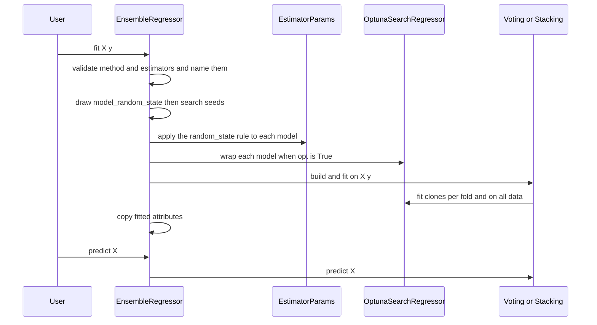

# Design Document

## Overview
**Purpose**: 複数の回帰モデルをまとめる EnsembleRegressor を、scikit-learn の VotingRegressor・StackingRegressor の上に作り直す。
**Users**: yikit で回帰モデルのアンサンブルを作る利用者（examples の simulate など）。licond は使わない。
**Impact**: `src/yikit/models/_ensemble.py` を作り直し、`OptunaSearchCV` をアンサンブルに入れるための小さな派生クラスを足す。`BorutaPy` を Pipeline の中で `perc="auto"` のまま使えるように直す。`boruta` 引数、`results_`、各分割のモデルの平均による予測はなくなる。

### Goals
- average・stacking・blending の予測が、同じモデルで直接作った scikit-learn のアンサンブルと一致する
- `opt=True` で各モデルを `ParamDistributions` の範囲で調整し、検証データを調整に使わない
- 渡したモデルの引数を保ち、`random_state` だけは `Objective` と同じ規則で再現できるようにする
- 特徴量の選択は、yikit の `BorutaPy` を前段に置いた Pipeline で行える

### Non-Goals
- 分類のアンサンブル、交差検証のスコアや OOF 予測の記録
- Boruta の選択の手順そのものの変更（`perc` の解決の経路だけを直す）
- 探索範囲の変更、NGBRegressor の `Base__*` が `OptunaSearchCV` で効かない問題
- examples の書き直し（release-0.4.0）

## Boundary Commitments

### This Spec Owns
- EnsembleRegressor の引数、まとめ方の組み立て、調整の付け方、`random_state` の規則の適用、入力の検査、学習後の属性
- `OptunaSearchCV` を回帰モデルとして扱わせる派生クラス（yikit の中だけで使う）
- `BorutaPy` の `perc` の解決の経路（`fit` と `fit_transform` の両方）と `perc_` 属性

### Out of Boundary
- `ParamDistributions`・探索範囲・`apply_params`・`find_unspecified_random_states` の振る舞い（optuna-tuning。ここでは使うだけ）
- `BorutaPy` のそれ以外の振る舞い（`_calc_auto_perc` の計算、進捗の表示、`__init__` の中の `_use_tqdm` など。module-quality）
- `OptunaSearchCV` 自体の振る舞い（試行の評価、失敗した試行の扱い）

### Allowed Dependencies
- scikit-learn（>=0.24.1）の公開 API: `VotingRegressor`、`StackingRegressor`、`LinearRegression`、`clone`、`is_regressor`、`check_random_state`、`check_is_fitted`
- yikit: `yikit.models._optuna.ParamDistributions`、`yikit.models._params.apply_params`・`find_unspecified_random_states`、`yikit.helpers.is_installed`
- optional: optuna-integration の `OptunaSearchCV`（なければ `optuna.integration` から。`_search_cv.py` だけが import し、`_ensemble.py` は `opt=True` のときに `fit` の中で `_search_cv` を import する）、optuna の `logging`
- 依存の向き: `_ensemble` → `_search_cv` → optuna-integration。`_ensemble` → `_optuna`・`_params`。逆向きの import はしない。`_ensemble` は feature_selection を import しない（Boruta は利用者が Pipeline で渡す）

### Revalidation Triggers
- EnsembleRegressor の引数や学習後の属性の名前が変わる（examples の simulate、release-0.4.0）
- `ParamDistributions` の引数（`n_features`）や `random_state` の規則が変わる（optuna-tuning の変更）
- `BorutaPy` の `perc` の扱いが変わる（module-quality が feature_selection を触るとき）

## Architecture

### Existing Architecture Analysis
- 今の EnsembleRegressor は、外側の交差検証の分割ごとに Boruta・`Objective`・学習・スコア・重要度を独自に回し、`results_` に溜め、予測では各分割のモデルを平均する。非公開の `_score` に依存し、scikit-learn 1.4 以上で必ず失敗する
- optuna-tuning が、探索範囲（`ParamDistributions`）と、引数を入れる部品（`_params.py`）を用意した

### Architecture Pattern & Boundary Map



**Architecture Integration**:
- Selected pattern: 引数から scikit-learn のアンサンブルを組み立てて委ねる薄いクラス
- Domain/feature boundaries: まとめ方と調整の付け方は EnsembleRegressor、`OptunaSearchCV` の回帰モデルの印は `_search_cv.py`、`perc` の解決は `BorutaPy`
- Existing patterns preserved: sklearn の estimator の決まり（`__init__` は属性に入れるだけ、学習した値は末尾 `_`）、optional な依存は使うときだけ import
- Steering compliance: 利用者が渡したモデルの引数を勝手に上書きしない。古い版（scikit-learn 0.24.1、Python 3.8）で動く部品だけを使う

### Technology Stack

| Layer | Choice / Version | Role in Feature | Notes |
|-------|------------------|-----------------|-------|
| Library | scikit-learn >=0.24.1 | VotingRegressor（0.21）、StackingRegressor（0.22）、`LinearRegression(positive=True)`（0.24） | 新しい依存はない |
| Optional | optuna-integration / optuna>=3.0 | `OptunaSearchCV`、ログの設定 | `opt=True` のときだけ |
| Optional | Boruta>=0.4.3 | yikit の `BorutaPy` の基底 | 利用者が Pipeline に入れるときだけ |

## File Structure Plan

### Directory Structure
```
src/yikit/models/
├── _ensemble.py      # 作り直し: EnsembleRegressor
└── _search_cv.py     # 新規: OptunaSearchRegressor（OptunaSearchCV を回帰モデルとして扱わせる。公開しない）
src/yikit/feature_selection/
└── _wrapper.py       # 変更: BorutaPy の perc の解決を _fit に移し、perc_ を持つ
tests/
├── test_ensemble.py  # 新規: EnsembleRegressor のテスト
└── test_boruta.py    # 追記: BorutaPy の fit_transform と perc_ のテスト
```

### Modified Files
- `tests/test_optuna.py` — `test_ensemble_builds_the_tuned_estimator_with_get_best_estimator` を削除する（optuna-tuning の要件 9 は、この spec で EnsembleRegressor が `Objective` を使わなくなることで置き換わる）
- `src/yikit/models/__init__.py` — 変更しない（`EnsembleRegressor` の公開はそのまま。`OptunaSearchRegressor` は公開しない）

## System Flows



- stacking と blending では、StackingRegressor が各分割で写しを学習し（まとめ役の学習に使う予測を作る）、最後に全データで学習し直す。写しは `OptunaSearchRegressor` ごと作られるので、調整もそれぞれの学習データだけで行われる（2.4）
- average では、VotingRegressor が全データで各モデル（調整付き）を学習する

## Requirements Traceability

| Requirement | Summary | Components | Interfaces | Flows |
|-------------|---------|------------|------------|-------|
| 1.1, 1.2, 1.3 | まとめ方ごとの sklearn のアンサンブル | EnsembleRegressor | `_build_ensemble` | fit |
| 1.4 | 全データで学習し直したモデルで予測 | EnsembleRegressor | `predict` | predict |
| 1.5 | モデル1つ | EnsembleRegressor | | |
| 1.6 | 名前の付け方 | EnsembleRegressor | `_named_estimators` | |
| 1.7 | `n_jobs`・`verbose` | EnsembleRegressor | `__init__` | |
| 2.1, 2.2, 2.3 | 調整 | EnsembleRegressor, OptunaSearchRegressor | `_prepare_estimator` | fit |
| 2.4 | 分割ごとの調整 | OptunaSearchRegressor, StackingRegressor | clone ごとの `fit` | fit |
| 2.5 | `opt=False` | EnsembleRegressor | `_prepare_estimator` | |
| 2.6 | optuna-integration がない | EnsembleRegressor | `_import_search_regressor` | |
| 2.7 | 範囲のないモデル | EnsembleRegressor | `_prepare_estimator` | |
| 2.8 | optuna のログ | OptunaSearchRegressor | `fit` | |
| 3.1, 3.2, 3.3, 3.4 | 引数と `random_state` の規則 | EnsembleRegressor, EstimatorParams | `apply_params`, `find_unspecified_random_states` | fit |
| 4.1 | Boruta の Pipeline | EnsembleRegressor, BorutaPy | | |
| 4.2, 4.3 | `perc` の解決 | BorutaPy | `_fit`, `perc_` | |
| 4.4 | `boruta` 引数の削除 | EnsembleRegressor | `__init__` | |
| 5.1, 5.2, 5.3, 5.4, 5.5, 5.6 | 学習後の属性 | EnsembleRegressor | `fit`, `predict` | |
| 6.1, 6.2, 6.3, 6.4 | 入力の検査 | EnsembleRegressor | `fit` | |
| 7.1, 7.2, 7.3, 7.4 | テストと docstring | テスト一式 | | |

## Components and Interfaces

| Component | Domain/Layer | Intent | Req Coverage | Key Dependencies (P0/P1) | Contracts |
|-----------|--------------|--------|--------------|--------------------------|-----------|
| EnsembleRegressor | models | 引数から sklearn のアンサンブルを組み立てて委ねる | 1, 2.1–2.7, 3, 4.1, 4.4, 5, 6 | VotingRegressor/StackingRegressor (P0), ParamDistributions (P0), EstimatorParams (P0) | Service, State |
| OptunaSearchRegressor | models | `OptunaSearchCV` に回帰モデルの印を付け、ログを抑える | 2.1, 2.4, 2.8, 5.3 | optuna-integration (P0) | Service |
| BorutaPy（変更） | feature_selection | `perc="auto"` をどの経路でも解決し、`perc_` に持つ | 4.2, 4.3 | boruta (P0) | Service |

### models

#### EnsembleRegressor（`src/yikit/models/_ensemble.py`）

| Field | Detail |
|-------|--------|
| Intent | 引数から VotingRegressor か StackingRegressor を組み立てて学習し、予測を委ねる |
| Requirements | 1.1–1.7, 2.1–2.7, 3.1–3.4, 4.1, 4.4, 5.1–5.6, 6.1–6.4 |

**Responsibilities & Constraints**
- `fit` の手順:
  1. `method` を検査する（`{"average", "stacking", "blending"}` 以外は使える値を示す ValueError、6.3）
  2. `estimators` を `(名前, モデル)` の並びにする（6.2 の空は ValueError）。モデルだけの要素は、型の名前を小文字にした名前にし、重なる名前には `make_pipeline` と同じく `-1`, `-2` … を付ける（1.6）。`(名前, モデル)` の組はそのまま使う
  3. 各モデルを `is_regressor` で検査する（Pipeline は最後の段で決まる）。違えば名前と型を示す ValueError（6.1）
  4. `rng = check_random_state(random_state)` から、`model_random_state` を1つ引き、続けてモデルごとに調整の種を引く
  5. 各モデルに、`find_unspecified_random_states`（元のモデル）で見つけた名前へ `model_random_state` を `apply_params` で入れた写しを作る（3.2、3.4）
  6. `opt=True` なら、写しを `OptunaSearchRegressor(写し, ParamDistributions(写し, n_features=X の列の数), n_trials=n_trials, cv=cv, scoring=scoring, random_state=種, verbose=verbose)` で包む。`ParamDistributions` の NotImplementedError は、名前と型を加えた NotImplementedError にして送出する（2.7）
  7. `method` に応じて組み立てる（1.1–1.3、1.7）
     - average: `VotingRegressor(並び, n_jobs=n_jobs, verbose=bool(verbose))`
     - stacking: `StackingRegressor(並び, final_estimator=LinearRegression(), cv=cv, n_jobs=n_jobs, verbose=verbose)`
     - blending: `StackingRegressor(並び, final_estimator=LinearRegression(positive=True, fit_intercept=False), cv=cv, n_jobs=n_jobs, verbose=verbose)`
  8. 組み立てたアンサンブルを `X`、`y` のまま（配列に変えずに）学習し、学習後の属性を写す
- X の列の数は `X.shape[1]`（`shape` がなければ `np.asarray(X)`）で読む。それ以外の入力の検査は中のアンサンブルに任せる
- 学習後の属性（5.1–5.5）: `estimator_`、`estimators_`、`named_estimators_`、`n_features_in_`、中のアンサンブルが持つときだけ `feature_names_in_`。stacking と blending では `final_estimator_` と `weights_`（`final_estimator_.coef_`）。average では `weights_ = None`。`model_random_state_`（引いた整数）。`results_` は持たない
- `predict`: `check_is_fitted(self, "estimator_")` の後、`estimator_.predict(X)`（1.4、5.6）

**Dependencies**
- Outbound: EstimatorParams（P0）、ParamDistributions（P0）、OptunaSearchRegressor（P0、`opt=True` のとき）
- External: scikit-learn のアンサンブル（P0）

**Contracts**: Service [x] / State [x]

##### Service Interface
```python
class EnsembleRegressor(RegressorMixin, BaseEstimator):
    def __init__(
        self,
        estimators: Sequence[Any] = (RandomForestRegressor(),),
        method: str = "blending",
        cv: int | BaseCrossValidator | Iterable[Any] = 5,
        n_jobs: int | None = None,
        random_state: int | np.random.RandomState | None = None,
        scoring: str | Callable[..., float] | None = "neg_mean_squared_error",
        verbose: int = 0,
        opt: bool = True,
        n_trials: int = 100,
    ) -> None: ...
    def fit(self, X: ArrayLike, y: ArrayLike) -> EnsembleRegressor: ...
    def predict(self, X: ArrayLike) -> NDArray[Any]: ...
```
- `__init__` は引数を同じ名前の属性に入れるだけ（6.4）。`boruta` はない（4.4）
- `n_jobs` の既定は None。docstring で「並列数は層ごとに掛け算になる。外側で並列にするときは各モデルを `n_jobs=1` に」と案内する（1.7）

**Implementation Notes**
- Integration: optuna-integration の import は `_import_search_regressor()` にまとめ、`_search_cv` の import に失敗したら「optuna-integration を入れるか `opt=False` にする」と案内する ImportError を元の例外につないで出す（2.6）
- Validation: 予測の一致（1.1–1.3）は、`opt=False`、各モデルの `random_state` を明示した場合に、直接作った sklearn のアンサンブルとの `assert_allclose` で確かめる
- Risks: stacking と blending の調整は (cv+1) 回行われる。docstring に計算量の目安を書く

#### OptunaSearchRegressor（`src/yikit/models/_search_cv.py`）

| Field | Detail |
|-------|--------|
| Intent | `OptunaSearchCV` を scikit-learn のアンサンブルが回帰モデルとして受け付けるようにし、`verbose=0` で optuna のログを抑える |
| Requirements | 2.1, 2.4, 2.8, 5.3 |

**Responsibilities & Constraints**
- `OptunaSearchCV` を継承する（optuna-integration から。なければ `optuna.integration` から import）。`__init__` は上書きしない
- クラス属性 `_estimator_type = "regressor"`（scikit-learn 1.6 未満の `is_regressor`）と、`__sklearn_tags__` の上書き（`super().__sklearn_tags__()` の `estimator_type` を "regressor" にする。1.6 以上でだけ呼ばれる）
- `fit`: `verbose == 0` なら、`optuna.logging.get_verbosity()` を覚えて WARNING にし、`super().fit(...)` の後に try/finally で戻す（2.8）。`verbose > 0` ならそのまま
- モジュールの直下に定義する（学習したアンサンブルを pickle できるように）。`yikit.models` からは公開しない

##### Service Interface
```python
class OptunaSearchRegressor(OptunaSearchCV):
    _estimator_type = "regressor"
    def __sklearn_tags__(self) -> Any: ...
    def fit(self, X: Any, y: Any = None, **fit_params: Any) -> OptunaSearchRegressor: ...
```

### feature_selection

#### BorutaPy（`src/yikit/feature_selection/_wrapper.py`、変更）

| Field | Detail |
|-------|--------|
| Intent | `perc="auto"` を `fit` と `fit_transform` のどちらでも解決し、引数を書き換えない |
| Requirements | 4.2, 4.3 |

**Responsibilities & Constraints**
- `_fit(X, y)` を上書きする: `check_X_y` の後、`perc_` を決める（`perc == "auto"` なら `_calc_auto_perc(X, y)`、そうでなければ `perc`）。tqdm の進捗バーを用意する（今 `fit` にある処理を移す）。boruta の `_fit` が読む `self.perc` に `perc_` を入れて `super()._fit(X, y)` を呼び、try/finally で `self.perc` を元に戻す
- `fit(X, y)` は `self._fit(X, y)` を呼ぶだけにする（docstring は保つ）。boruta の `fit_transform` は `self._fit` を呼ぶので、同じ経路を通る
- それ以外の振る舞い（`_calc_auto_perc`、`get_support`、表示）は変えない

## Error Handling

| 状況 | 出すもの | 場所 |
|------|---------|------|
| `method` が不正 | ValueError（使える値を示す） | `EnsembleRegressor.fit` |
| `estimators` が空 | ValueError | `EnsembleRegressor.fit` |
| 回帰モデルでないもの | ValueError（名前と型） | `EnsembleRegressor.fit` |
| `opt=True` で optuna-integration がない | ImportError（入れるか `opt=False`。元の例外をつなぐ） | `EnsembleRegressor.fit` |
| `opt=True` で範囲のないモデル | NotImplementedError（名前と型。元の例外をつなぐ） | `EnsembleRegressor.fit` |
| 学習前の `predict` | NotFittedError | `EnsembleRegressor.predict` |
| `boruta=` を渡す | TypeError（Python の引数の検査） | `EnsembleRegressor.__init__` |

## Testing Strategy

小さなデータ（60〜100 サンプル、4〜6 特徴量、seed 334）を各テストファイルの中に置く。調整のテストは `n_trials=2`、`cv=3` 程度にする。optuna-integration と boruta を使うテストは `pytest.importorskip` で飛ばす（7.3）。

### Unit Tests
- `tests/test_boruta.py`（4.2、4.3）: `perc="auto"` の BorutaPy を `fit_transform` でき、`fit` と同じ特徴量を選ぶ。`fit` の後も `get_params()["perc"] == "auto"` で、`perc_` が数値。`perc=80` なら `perc_ == 80`。Pipeline の中で学習・予測できる
- `tests/test_ensemble.py` の検査（6.1–6.4、4.4）: 回帰モデルでないもの、空、不正な `method` の ValueError、`boruta=` の TypeError、`clone` と `get_params` の往復、学習前の `predict` の NotFittedError
- 名前（1.6）: モデルだけの並び（重なりに番号）と `(名前, モデル)` の組

### Integration Tests（`tests/test_ensemble.py`）
- 一致（1.1–1.5）: `opt=False`、`random_state` を明示した Ridge・RandomForest・SVR で、average・stacking・blending の予測が直接作った VotingRegressor・StackingRegressor と一致する。モデル1つでも学習・予測できる。blending の `weights_` は非負
- 調整（2.1–2.4、5.3）: `opt=True, n_trials=2` で、`estimators_` の各要素が `OptunaSearchCV` で、`study_` の試行が 2 つ、`best_params_` の名前が `ParamDistributions` と同じ。stacking で、調整付きのモデルの `fit` が cv 回（分割の学習データの大きさ）と1回（全データ）呼ばれる
- optuna-integration がない（2.6）: import を失敗させて、`opt=True` の `fit` が案内付きの ImportError、`opt=False` は学習できる
- 範囲のないモデル（2.7）: `KNeighborsRegressor` と `opt=True` で、名前と型を含む NotImplementedError
- ログ（2.8）: `verbose=0` の調整で optuna の INFO のログが出ず、`fit` の後に optuna の verbosity が元に戻る
- 引数（3.1–3.4）: `RandomForestRegressor(n_jobs=1, random_state=7)` の `n_jobs` と `random_state` が `estimators_` でも同じ。`random_state=None` のモデルには `model_random_state_` が入る。同じ `random_state` で2回学習すると同じ予測。渡したモデルのオブジェクトは変わらない
- Boruta（4.1）: `Pipeline([("boruta", BorutaPy(..., max_iter 小)), ("ridge", Ridge())])` を各まとめ方で学習・予測でき、`opt=True` では `best_params_` の名前が `ridge__alpha`
- 属性（5.1、5.2、5.4、5.5）: `estimator_` の型、`named_estimators_` の名前、`final_estimator_`、average の `weights_ is None`、`n_features_in_`、DataFrame で学習したときの `feature_names_in_`（scikit-learn 1.0 以上）、`results_` がない
- 既存のテスト: `tests/test_optuna.py` の EnsembleRegressor の AST テストを削除する
