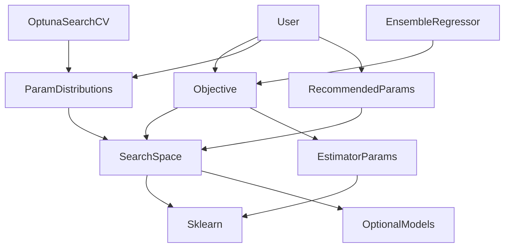
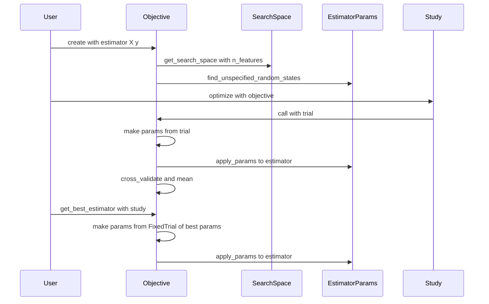

# Design Document

## Overview
**Purpose**: yikit で optuna を使ってモデルの引数を探索する利用者（licond など）に、渡したモデルの引数を保つ探索と、`Objective` と `OptunaSearchCV` で共通の探索範囲を提供する。
**Users**: `Objective` で study を自分で回す利用者と、`ParamDistributions` を `OptunaSearchCV` に渡す利用者。ensemble-on-sklearn も後者の形で使う。
**Impact**: `src/yikit/models/_optuna.py` を作り直し、探索範囲の表と入れ子の解決を `_search_space.py` に、引数をモデルに入れる処理を `_params.py` に分ける。LinearModelRegressor と SupportVectorRegressor を削除し、`RecommendedParams` を公開する。0.4.0-rc.0 と同じ種でも探索の結果は変わる。

### Goals
- `Objective` は、探索した引数・`random_state` の規則の値・利用者の `fixed_params` 以外をモデルに入れない
- 探索範囲を1つの表に持ち、`Objective` と `ParamDistributions` が同じ範囲を使う
- `Pipeline` と `TransformedTargetRegressor` に包んだモデルを、引数名に前置きを付けて探索できる
- 推奨の固定値を、`RecommendedParams` で利用者が明示したときだけ使う

### Non-Goals
- 試行の評価の方法（交差検証、scoring、交差検証の `n_jobs`）と TPESampler の種の引き方の変更
- `Pipeline`・`TransformedTargetRegressor` 以外の meta-estimator の入れ子の解決
- EnsembleRegressor を今の scikit-learn で動かすこと（ensemble-on-sklearn）、GBDTRegressor の修正（gbdt-fix）
- examples、CHANGELOG、リリース（release-0.4.0）

## Boundary Commitments

### This Spec Owns
- 探索範囲の表（モデルの型ごとの optuna の分布）と、推奨の固定値の表
- 入れ子の解決（探索するモデルを見つけ、引数名の前置きを決める規則）
- 引数をモデルに入れる処理（入れ子の名前の扱い、元のモデルと物を共有しないこと）と、未指定の `random_state` の判定
- 公開する `Objective`・`ParamDistributions`・`RecommendedParams` の振る舞いと引数
- `yikit.models` から LinearModelRegressor・SupportVectorRegressor をなくすこと
- EnsembleRegressor の中の、探索の結果からモデルを作る1か所

### Out of Boundary
- EnsembleRegressor のそれ以外の部分（非公開の `_score` の使用、`np.bool`、Boruta、まとめ方）。scikit-learn 1.4 以上で `fit` が失敗する問題は直さない
- GBDTRegressor のクラス自体（early stopping、`**kwargs`）。探索範囲の表の行だけをこの spec が持つ
- `OptunaSearchCV` の振る舞い（学習に失敗した試行の扱い、`set_params` の呼び方）
- 0.4.0-rc.0 から引き継ぐ探索範囲の値（`criterion` の版による対応を除く）

### Allowed Dependencies
- scikit-learn（>=0.24.1）の公開 API: `clone`、`get_params`・`set_params`、`cross_validate`、`check_cv`、`check_scoring`、`check_X_y`、`check_random_state`、`Pipeline`、`TransformedTargetRegressor`、各モデルのクラス
- optuna（>=3.0）: `optuna.distributions` の3種類の分布、`Trial`、`FixedTrial`、`TPESampler`
- optional: lightgbm、ngboost（`is_installed` で確かめてから import する）
- yikit: `yikit.helpers.is_installed`、`yikit.models._gbdt.GBDTRegressor`
- 依存の向き: `_search_space` と `_params` は互いに依存しない。`_optuna` は両方に依存する。`_ensemble` は `_optuna` に依存する（`fit` の中で import する今の形のまま）。逆向きの import はしない

### Revalidation Triggers
- `get_search_space`・`resolve_estimator` の返す値の形、または引数名の前置きの規則が変わる（ensemble-on-sklearn が使う）
- `Objective` の引数、`get_best_params` の返す内容、`model_random_state` の決め方が変わる（licond が使う）
- GBDTRegressor の引数名が変わる（gbdt-fix。表の行を合わせ、その行の引数で学習できることを gbdt-fix のテストで確かめる）
- 表に行を足す・消す・順番を変える（`ParamDistributions` を使う側の探索が変わる）

## Architecture

### Existing Architecture Analysis
- 今の `_optuna.py` は、`Objective.__call__` と `ParamDistributions._build_distributions` が、それぞれモデルの型で分岐して同じ範囲を書いている
- `Objective` は固定値（`n_jobs=-1`、`random_state=self.rng` など）を入れ、`get_best_estimator` は型から作り直す（`self.model(**best_params)`）
- ngboost の NGBRegressor は `set_params` が `setattr` だけで、入れ子の名前を解かず、`random_state` を RandomState に変換しない（research.md）。今の `Objective` は Base の DecisionTreeRegressor を毎回作り直すことで回避している
- EnsembleRegressor は `objective.model` と `objective.fixed_params_` を使う

### Architecture Pattern & Boundary Map



**Architecture Integration**:
- Selected pattern: データの表と、それを使う薄い窓口。表は `_search_space.py` に置き、窓口の3つのクラスは表を読むだけにする
- Domain/feature boundaries: 「何を探索するか」（`_search_space.py`）と「引数をモデルにどう入れるか」（`_params.py`）を分ける。`Objective` だけが両方を組み合わせる
- Existing patterns preserved: optional な依存は `is_installed()` で分岐する。公開する名前は `models/__init__.py` で optuna の有無により条件付きで足す。`ParamDistributions` は dict を継承し、そのまま `OptunaSearchCV` に渡せる
- New components rationale: `_params.py` は ngboost のように `set_params` が sklearn と違うモデルにも引数を正しく入れるために要る。`_search_space.py` は範囲を1か所にするために要る
- Steering compliance: 渡されたモデルの引数を勝手に上書きしない（tech.md）。複数のモデルにまたがる設定は1つのモジュールにまとめる（structure.md）。Python 3.8 で動く型の書き方

### Technology Stack

| Layer | Choice / Version | Role in Feature | Notes |
|-------|------------------|-----------------|-------|
| Library | scikit-learn >=0.24.1 | モデル、交差検証、`clone`、入れ子の estimator | 新しい依存はない |
| Library | optuna >=3.0 | 分布、試行、`FixedTrial`、TPESampler | 3.0 で入った `IntDistribution`・`FloatDistribution` を使う |
| Library | optuna-integration | `OptunaSearchCV`（テストと利用者の側） | yikit のコードは import しない |
| Optional | lightgbm 3.x・4.x、ngboost | 表の行（入っているときだけ） | |

## File Structure Plan

### Directory Structure
```
src/yikit/models/
├── _search_space.py   # 新規: 探索範囲と推奨値の表、入れ子の解決、表の照合
├── _params.py         # 新規: 引数をモデルに入れる処理、未指定の random_state の判定
└── _optuna.py         # 作り直し: suggest への読み替え、Objective、ParamDistributions、RecommendedParams
tests/
├── test_search_space.py  # 新規: 表、照合の順番、入れ子の前置き、criterion、RecommendedParams の中身
├── test_params.py        # 新規: apply_params と find_unspecified_random_states（ngboost を含む）
└── test_optuna.py        # 拡充: Objective の引数の扱い、ParamDistributions、OptunaSearchCV との組み合わせ
```

### Modified Files
- `src/yikit/models/__init__.py` — `_linear`・`_svm` の import と `__all__` の2つの名前を消す。optuna があるときに `RecommendedParams` を足す
- `src/yikit/models/_ensemble.py` — `objective.model(**objective.fixed_params_, **study.best_params)` を `objective.get_best_estimator(study)` に置き換える（1か所だけ）
- `src/yikit/models/_linear.py`・`src/yikit/models/_svm.py` — 削除

## System Flows



- 引数の組み立ては、試行と最良の引数で同じ手順（`_make_params`）を通る。最良の引数は、最良の試行の値を持つ `FixedTrial` で組み立て直す
- 試行で `cross_validate` が ValueError（全分割の学習の失敗）を出したら、元のメッセージを `FitFailedWarning` で出して nan を返す。optuna はその試行を FAIL として記録し、次へ進む。一部の分割の失敗では `cross_validate` が nan を返すので、平均も nan になり、同じく FAIL になる

## Requirements Traceability

| Requirement | Summary | Components | Interfaces | Flows |
|-------------|---------|------------|------------|-------|
| 1.1 | 試行のモデルに入れる引数を限る | Objective, EstimatorParams | `_make_params`, `apply_params` | 試行 |
| 1.2 | `n_jobs` を変えない | Objective | `_make_params` | 試行・最良 |
| 1.3 | 暗黙の固定値を入れない | Objective, SearchSpace | 表に固定値を持たない | |
| 1.4 | `fixed_params` を最優先 | Objective | `_make_params` の合成の順番 | |
| 1.5 | `fixed_params` の引数は探索しない | Objective | `param_distributions` から除く | |
| 1.6 | `get_best_params` の中身 | Objective | `get_best_params` | 最良 |
| 1.7 | `get_best_estimator` | Objective, EstimatorParams | `get_best_estimator`, `apply_params` | 最良 |
| 1.8 | 学習に失敗した試行 | Objective | `__call__` | 試行 |
| 2.1, 2.2, 2.6 | 未指定の `random_state` にだけ整数 | EstimatorParams, Objective | `find_unspecified_random_states` | |
| 2.3, 2.4 | 整数を1回だけ引く、再現性 | Objective | `model_random_state` | |
| 2.5 | RandomState を共有させない | EstimatorParams | `apply_params` | |
| 3.1, 3.2, 3.3, 3.4, 3.5, 3.6 | 登録済みのモデルと範囲 | SearchSpace | `_SEARCH_SPACES` | |
| 3.7 | 版で使えない値 | SearchSpace | `_criterion_choices` | |
| 4.1, 4.2, 4.3, 4.4 | 入れ子の解決 | SearchSpace | `resolve_estimator` | |
| 4.5 | 前置きの名前が両方で使える | SearchSpace, EstimatorParams | `get_search_space`, `apply_params` | |
| 4.6 | 入れ子のときの特徴量の数 | Objective, ParamDistributions | `n_features` | |
| 5.1, 5.2, 5.3, 5.4 | `custom_params` | Objective, ParamDistributions | `custom_params` | |
| 6.1, 6.2, 6.3, 6.4, 6.5, 6.6 | ParamDistributions | ParamDistributions, SearchSpace | `ParamDistributions.__init__` | |
| 7.1, 7.2, 7.3, 7.4, 7.5, 7.6 | RecommendedParams | RecommendedParams, SearchSpace | `get_recommended_params` | |
| 8.1 | 包みのクラスの削除 | models パッケージ | `__init__.py` | |
| 8.2 | 代わりの書き方の案内 | Objective, ParamDistributions | docstring | |
| 9.1, 9.2 | EnsembleRegressor | EnsembleRegressor | `get_best_estimator` | |
| 10.1, 10.2, 10.3, 10.4, 10.5, 10.6 | テストと docstring | テスト一式 | | |

## Components and Interfaces

| Component | Domain/Layer | Intent | Req Coverage | Key Dependencies (P0/P1) | Contracts |
|-----------|--------------|--------|--------------|--------------------------|-----------|
| SearchSpace | データ | 探索範囲と推奨値の表、入れ子の解決 | 1.3, 3, 4.1–4.5, 6.6, 7.2, 7.4, 7.5 | optuna.distributions (P0), sklearn (P0) | Service |
| EstimatorParams | 引数の操作 | 引数をモデルに入れる、未指定の random_state を見つける | 1.1, 1.7, 2.1, 2.2, 2.5, 2.6, 4.5 | sklearn (P0) | Service |
| Objective | 窓口 | optuna の目的関数 | 1, 2, 4.6, 5, 8.2 | SearchSpace (P0), EstimatorParams (P0) | Service, State |
| ParamDistributions | 窓口 | `OptunaSearchCV` に渡す分布の dict | 4.6, 5, 6, 8.2 | SearchSpace (P0) | Service |
| RecommendedParams | 窓口 | 推奨の固定値の dict | 7 | SearchSpace (P0) | Service |
| models パッケージ | 公開 | 公開する名前 | 8.1 | | |
| EnsembleRegressor | 利用側 | 探索の結果からモデルを作る | 9 | Objective (P0) | |

### データ

#### SearchSpace（`src/yikit/models/_search_space.py`）

| Field | Detail |
|-------|--------|
| Intent | モデルの型ごとの探索範囲と推奨値を表で持ち、入れ子を解いて前置きを付けた辞書を返す |
| Requirements | 1.3, 3.1–3.7, 4.1–4.5, 6.6, 7.2, 7.4, 7.5 |

**Responsibilities & Constraints**
- 探索範囲の表 `_SEARCH_SPACES` は、`(型または型のタプル, {引数名: 分布}, 特徴量の数で上限を切り詰める引数名のタプル)` の並び。上から順に `isinstance` で照合し、最初に当たった行を使う
- 表の値（3.2 の範囲は 0.4.0-rc.0 と同じ）:

| 型 | 引数と分布 |
|----|-----------|
| GBDTRegressor, LGBMRegressor | `n_estimators` Int(10, 1000, log)、`min_child_weight` Float(0.001, 10, log)、`colsample_bytree` Float(0.6, 0.95)、`subsample` Float(0.6, 0.95)、`num_leaves` Int(8, 512, log) |
| RandomForestRegressor | `min_samples_split` Int(2, 16)、`max_depth` Int(10, 100)、`n_estimators` Int(10, 1000, log) |
| SVR | `C` Float(2^-5, 2^10, log)、`epsilon` Float(2^-10, 1, log) |
| LinearSVR | SVR と同じ |
| MLPRegressor | `hidden_layer_sizes` Int(50, 300)、`alpha` Float(1e-5, 1e-3, log)、`learning_rate_init` Float(1e-5, 1e-3, log) |
| NGBRegressor | `Base__max_depth` Int(2, 100)、`Base__criterion` Categorical(版による)、`n_estimators` Int(10, 1000, log)、`minibatch_frac` Float(0.5, 1.0) |
| PLSRegression | `n_components` Int(1, 10)。`n_components` を特徴量の数で切り詰める |
| Lasso | `alpha` Float(0.1, 10, log) |
| ElasticNet | `alpha` Float(0.1, 10, log)、`l1_ratio` Float(0.1, 1.0) |
| Ridge | `alpha` Float(0.1, 10, log) |

- `Lasso` は `ElasticNet` の派生クラスなので、`Lasso` の行を `ElasticNet` より前に置く
- lightgbm・ngboost の行は、`is_installed` が真のときだけ表に入れる
- `_criterion_choices()`: scikit-learn の版が 1.0 未満なら `["mse", "friedman_mse"]`、1.9 未満なら `["squared_error", "friedman_mse"]`、それ以上なら `["squared_error"]`。版は `sklearn.__version__` の先頭の2つの数で比べる（新しい依存を使わない）
- 推奨値の表 `_RECOMMENDED_PARAMS` は `(型, {引数名: 値})` の並び。最初は `(SVR, {"gamma": "auto"})` だけ
- 表には `n_jobs`・`random_state` などの固定値を入れない（1.3）

**Dependencies**
- External: optuna.distributions — 分布の型 (P0)、scikit-learn — モデルの型と meta-estimator (P0)、lightgbm・ngboost — optional な行 (P1)
- Outbound: `yikit.models._gbdt.GBDTRegressor`、`yikit.helpers.is_installed` (P0)

**Contracts**: Service [x]

##### Service Interface
```python
def resolve_estimator(estimator: Any) -> tuple[str, Any]:
    """Unwrap Pipeline (last step) and TransformedTargetRegressor (regressor).

    Returns the prefix such as "regressor__svr__" and the innermost model.
    Other estimators are returned as they are with the prefix "".
    """

def get_search_space(
    estimator: Any, *, n_features: int | None = None
) -> dict[str, BaseDistribution] | None:
    """Return the prefixed distributions of the first matching row.

    Bounded names get high = min(high, n_features) when n_features is given.
    Returns None when no row matches the resolved model.
    """

def get_recommended_params(estimator: Any) -> dict[str, Any]:
    """Return the prefixed recommended values, or {} when no row matches."""

def ignores_nested_set_params(model: Any) -> bool:
    """True for models whose own set_params does not apply nested names
    (ngboost's NGBRegressor)."""
```
- Preconditions: `n_features` は 1 以上の整数か None
- Postconditions: 返す辞書は毎回新しく作る（表の分布や dict を呼び出し側と共有しない）。前置きは `resolve_estimator` の値を全部の名前に付ける
- Invariants: `Pipeline` の最後の段以外と `TransformedTargetRegressor` の `transformer` はたどらない（4.4）。`TransformedTargetRegressor(regressor=None)` は中のモデルを None とし、どの行にも当たらない

**Implementation Notes**
- Validation: 表の各行のモデルに、その行の分布の下限・上限・各選択肢を入れて小さなデータで学習できることを、テストで確かめる（`criterion` は FutureWarning をエラーにして確かめる）。GBDTRegressor の行は除く。GBDTRegressor の学習は gbdt-fix が持ち（今は LightGBM 4 で fit が失敗する）、この行の引数で学習できることは gbdt-fix のテストで確かめる
- Risks: 表の照合の順番を誤ると、派生クラスに別の行が当たる。`Lasso` の照合をテストで確かめる

### 引数の操作

#### EstimatorParams（`src/yikit/models/_params.py`）

| Field | Detail |
|-------|--------|
| Intent | 前置き付きの引数を、元を変えずにモデルの写しへ入れる。未指定の `random_state` の名前を見つける |
| Requirements | 1.1, 1.7, 2.1, 2.2, 2.5, 2.6, 4.5 |

**Responsibilities & Constraints**
- `apply_params(estimator, params)`:
  1. `clone(estimator)` を作る
  2. 引数を、`__` を含まない名前と、先頭の名前ごとにまとめた入れ子の名前に分ける
  3. 入れ子の名前は、写しの `get_params(deep=True)` から先頭の名前の値（中のモデル）を取り、再帰的に `apply_params` して、その先頭の名前の値として扱う
  4. コンストラクタの引数（`__init__` の引数。`**kwargs` を持つクラスではすべての名前）にあたる名前は、`type(est)(**{**est.get_params(deep=False), **値})` で作り直して入れる。それ以外で `get_params(deep=True)` にある名前（`Pipeline` の段の名前）は `set_params` で入れる
  5. どちらにもない名前は、モデルの型と名前を示す ValueError にする（ngboost の `set_params` は何でも受け付けてしまうため、自分で検査する）
- `find_unspecified_random_states(estimator)`: `get_params(deep=True)` の名前のうち、`random_state` か `__random_state` で終わるもので、値が None か `check_random_state(None)` と同一（NumPy の大域の RandomState）のものを返す。値が estimator で、その中の名前が `get_params(deep=True)` に出ていないもの（ngboost の `Base`）は、自分で再帰してたどる
- 元のモデルは変えない。返すモデルは、元のモデルと RandomState や中のモデルを共有しない（`clone` の deepcopy による）

**Dependencies**
- External: scikit-learn の `clone`・`check_random_state` (P0)
- Inbound: Objective (P0)

**Contracts**: Service [x]

##### Service Interface
```python
def apply_params(estimator: Any, params: Mapping[str, Any]) -> Any:
    """Return an unfitted copy of ``estimator`` with ``params`` applied.

    Raises
    ------
    ValueError
        If a name is not a parameter of the targeted estimator.
    """

def find_unspecified_random_states(estimator: Any) -> list[str]:
    """Return the prefixed names of ``random_state`` parameters left unspecified."""
```
- Postconditions: `apply_params` の結果の `get_params` は、`params` の値を反映し、それ以外は元のモデルの値に等しい
- Invariants: `random_state` を引数に持たないモデルの名前は返さない（2.6）

**Implementation Notes**
- Integration: ngboost では、`Base__max_depth` は Base の写しに入り、`random_state` の整数はコンストラクタで RandomState に変換される（research.md）
- Risks: コンストラクタで引数を加工するモデル（ngboost）でも、`clone` と同じ方式なので動く

### 窓口

#### Objective（`src/yikit/models/_optuna.py`）

| Field | Detail |
|-------|--------|
| Intent | optuna の目的関数。渡したモデルの写しに試行の引数を入れて交差検証する |
| Requirements | 1.1–1.8, 2.1–2.6, 4.6, 5.1–5.4, 8.2 |

**Responsibilities & Constraints**
- `__init__` の順番: `check_X_y`、`check_cv`、`check_random_state(random_state)` で乱数を作る → TPESampler の種を引く（今と同じ）→ `model_random_state` の整数を引く（2.3）→ 未指定の `random_state` の名前を集める → 探索範囲を作る
- 探索範囲 `param_distributions` は `get_search_space(estimator, n_features=X.shape[1])` から、`fixed_params` に覆われる名前を除いたもの（1.5、4.6）。固定の名前は、それ自身と `<固定の名前>__` で始まる名前を覆う（`Base` を固定すると `Base__max_depth` も探索しない）。どの行にも当たらないときは None
- `random_state` の規則の値も、`fixed_params` に覆われる名前には入れない。固定の値が estimator のときは、その元のオブジェクトに `find_unspecified_random_states` をかけ、見つけた名前に `<固定の名前>__` を付けて規則を当てる（中の None には整数、明示した値はそのまま。1.4、2.1、2.2）。`custom_params` が固定の estimator の下の名前を返したときは、その写しの上に入れる
- `custom_params` も探索範囲もないとき（None、または範囲が None で `custom_params` が None）は、`__init__` で NotImplementedError にする（5.4）。`fixed_params` と未指定の `random_state` の名前は `__init__` で一度 `apply_params` して確かめ、誤りは ValueError にする
- 引数の組み立て `_make_params(trial)`: `custom_params(trial)` が空でない辞書を返せばそれを、そうでなければ `param_distributions` を `_suggest` で読み替えた値を、探索した引数とする（5.1）。結果は `{**random_state の規則の値, **探索した引数, **fixed_params}`（1.4）。`custom_params` が空を返し、範囲もない場合は NotImplementedError
- `__call__`: `_make_params(trial)` → `apply_params` → `estimator_` に入れる → `cross_validate(estimator_, X, y, cv=cv, scoring=scoring, n_jobs=n_jobs)` の `test_score` の平均を返す。ValueError は 1.8 の扱い
- `get_best_params(study)`: `_make_params(FixedTrial(study.best_params))`（1.6）
- `get_best_estimator(study)`: `apply_params(estimator, get_best_params(study))`。学習はしない（1.7）
- `n_jobs` を引数としてモデルに入れる処理はない（1.2）

**Dependencies**
- Outbound: SearchSpace — 探索範囲 (P0)、EstimatorParams — 引数を入れる (P0)
- External: optuna — `Trial`、`FixedTrial`、`TPESampler` (P0)、scikit-learn — `cross_validate` ほか (P0)

**Contracts**: Service [x] / State [x]

##### Service Interface
```python
class Objective:
    def __init__(
        self,
        estimator: Any,
        X: ArrayLike,
        y: ArrayLike,
        custom_params: Callable[[optuna.trial.BaseTrial], dict[str, Any]] | None = None,
        fixed_params: Mapping[str, Any] | None = None,
        cv: int | BaseCrossValidator | Iterable[Any] = 5,
        random_state: int | np.random.RandomState | None = None,
        scoring: str | Callable[..., float] | None = None,
        n_jobs: int | None = None,
    ) -> None: ...

    def __call__(self, trial: optuna.trial.Trial) -> float: ...
    def get_best_params(self, study: optuna.study.Study) -> dict[str, Any]: ...
    def get_best_estimator(self, study: optuna.study.Study) -> Any: ...
```
- 引数の並びと名前は今と同じ。既定値だけ `custom_params=None`、`fixed_params=None` に変える（今の `lambda trial: {}` と `{}` を渡しても同じ意味）
- Preconditions: `study` は少なくとも1つの完了した試行を持つ（ないときは optuna の ValueError がそのまま出る）

##### State Management
- 公開する属性: `estimator`、`X`、`y`、`custom_params`、`fixed_params`（dict）、`cv`、`scoring`、`n_jobs`、`sampler`、`model_random_state`（int）、`param_distributions`（dict か None）、`estimator_`（最後の試行のモデル）
- なくす属性: `model`、`fixed_params_`、`rng`（EnsembleRegressor だけが使っていた。CHANGELOG に書く）

**Implementation Notes**
- Integration: 学習に失敗した試行は `warnings.warn(..., FitFailedWarning)` で元のメッセージを出し、`float("nan")` を返す（握りつぶさない）
- Validation: 同じ `random_state` の2つの `Objective` で、`model_random_state` と探索の結果が同じになることをテストする

#### ParamDistributions（`src/yikit/models/_optuna.py`）

| Field | Detail |
|-------|--------|
| Intent | `OptunaSearchCV` の `param_distributions` に渡す、前置き付きの分布の dict |
| Requirements | 4.6, 5.1–5.4, 6.1–6.6, 8.2 |

**Responsibilities & Constraints**
- dict を継承し、`__init__` で中身を詰める。中身は `get_search_space(estimator, n_features=n_features)` と同じ（6.1）。`n_features` が None のときは表の上限（10）のまま（6.4）
- `custom_params` が分布の dict ならそれを、関数なら `custom_params(FixedTrial({}))` の結果を使う。空でなければ表の代わりに使う（5.1）。値が分布でないものを含むときは TypeError
- 範囲も `custom_params` もないときは NotImplementedError（5.4）
- `resolve_estimator` の結果のモデルが `ignores_nested_set_params` に当たり、中身にそのモデルの中の入れ子の名前（前置きの後にさらに `__` を含む名前）があるときは、`UserWarning` で「`OptunaSearchCV` ではその引数が効かないので `Objective` を使う」と伝える（6.6）
- `n_features` はキーワード専用。今の3番目の位置引数（`fixed_params`）を位置で渡したコードは TypeError になる（6.5）

##### Service Interface
```python
class ParamDistributions(dict):
    def __init__(
        self,
        estimator: Any,
        custom_params: (
            Mapping[str, BaseDistribution]
            | Callable[[optuna.trial.BaseTrial], Mapping[str, BaseDistribution]]
            | None
        ) = None,
        *,
        n_features: int | None = None,
    ) -> None: ...
```
- 属性: `estimator`、`custom_params`、`n_features`
- `OptunaSearchCV` を `clone` したときの deepcopy でも中身が保たれる（dict の継承のまま）

#### RecommendedParams（`src/yikit/models/_optuna.py`）

| Field | Detail |
|-------|--------|
| Intent | yikit の推奨の固定値を、前置き付きの dict として返す |
| Requirements | 7.1–7.6 |

- dict を継承し、`__init__(self, estimator: Any) -> None` で `get_recommended_params(estimator)` を詰める。当たらなければ空（7.4）
- `Objective(..., fixed_params=RecommendedParams(est))` と `est.set_params(**RecommendedParams(est))` のどちらにもそのまま渡せる（7.3）
- `Objective` と `ParamDistributions` は `RecommendedParams` を参照しない（7.6）

### 公開と利用側

#### models パッケージ（`src/yikit/models/__init__.py`）
- `EnsembleRegressor` は常に、`Objective`・`ParamDistributions`・`RecommendedParams` は optuna があるときに、`GBDTRegressor` は lightgbm があるときに公開する
- `LinearModelRegressor`・`SupportVectorRegressor` は公開しない（8.1）。案内用の特別なエラーは作らない

#### EnsembleRegressor（`src/yikit/models/_ensemble.py`）
- 探索の後のモデルを `objective.get_best_estimator(study)` で作る（9.1）。他は変えない（9.2）

## Error Handling

### Error Strategy
- 誤った使い方は、作るときに分かるものは `__init__` で出す（範囲がない、引数名の誤り）
- 学習の失敗は、試行の失敗として記録し、探索を続ける（1.8）。メッセージは警告として出す

### Error Categories and Responses
| 状況 | 出すもの | 場所 |
|------|---------|------|
| 範囲がなく `custom_params` もない | NotImplementedError（型の名前と `custom_params` の案内） | `Objective.__init__`、`ParamDistributions.__init__`、試行（`custom_params` が空を返したとき） |
| `fixed_params` などの名前がモデルにない | ValueError（型と名前） | `apply_params`（`Objective.__init__` で一度確かめる） |
| `ParamDistributions` の `custom_params` が分布でない値を返す | TypeError | `ParamDistributions.__init__` |
| `ParamDistributions` に `fixed_params`・`random_state` を渡す | TypeError（Python の引数の検査） | `ParamDistributions.__init__` |
| 試行の学習が失敗する | `FitFailedWarning` と nan（試行は FAIL） | `Objective.__call__` |
| ngboost の入れ子の名前を `OptunaSearchCV` で探索する | UserWarning | `ParamDistributions.__init__` |

## Testing Strategy

速さのため、引数だけを確かめるテストは `yikit.models._optuna.cross_validate` を固定のスコアを返す関数に差し替える（monkeypatch）。学習の結果を見るテストだけ、小さなデータ（40〜60 サンプル、3〜5 特徴量、seed 334）で実際に学習する。lightgbm・ngboost を使うテストは `pytest.importorskip` で飛ばす（10.4）。

### Unit Tests
- `tests/test_search_space.py`:
  - 表の各モデルに対する引数名と分布（3.1–3.6）。`Lasso` には `l1_ratio` がなく、`ElasticNet` にはある。派生クラスにも同じ行が当たる
  - `Pipeline`、`make_pipeline`、`TransformedTargetRegressor`、その組み合わせの前置き（`svr__C`、`regressor__C`、`regressor__svr__C`）と、前段の引数を探索しないこと（4.1–4.4）
  - PLS の上限が `min(10, n_features)` になり、`n_features` がなければ 10 のまま（3.3、6.4）
  - `Base__criterion` の各選択肢で DecisionTreeRegressor が FutureWarning なしで学習できる（3.7）
  - `get_recommended_params`: SVR は `{"gamma": "auto"}`、入れ子では前置き付き、それ以外は空（7.1、7.2、7.4、7.5）
- `tests/test_params.py`:
  - `apply_params` が入れ子の名前を入れ、元のモデルを変えない。存在しない名前は ValueError
  - ngboost: `Base__max_depth` と `random_state=7` が効き、`minibatch_frac=0.5` で学習できる。返すモデルと Base が元のモデルと RandomState を共有しない（2.5）
  - `find_unspecified_random_states`: None、明示した値、`random_state` を持たないモデル、`Pipeline` の各段、ngboost の大域の RandomState と Base（2.1、2.2、2.6）

### Integration Tests（`tests/test_optuna.py`）
- licond の場合（10.1）: `n_jobs=2` の LGBMRegressor と RandomForestRegressor で、試行の `estimator_`、`get_best_params`（`n_jobs` を含まない）、`get_best_estimator` の `n_jobs` が 2。`random_state=7` が残る。`random_state=None` では `model_random_state` の整数が入り、同じ `random_state` の2つの `Objective` で同じ整数と同じ最良の引数・値になる。NGBRegressor の Base が None のときは整数、明示したときはその値。`fixed_params={"n_jobs": 3, "random_state": 5}` が使われ、`fixed_params` の名前は試行の `params` に出ない（1.1–1.7、2.1–2.5）
- `SVR(kernel="linear")` の `get_best_estimator` で `kernel`・`gamma` が渡した値のまま（1.3、1.7）
- 学習に失敗する試行（特徴量 3 のデータで、`SelectKBest(k=2)` の後に PLS を置いた `Pipeline`）を含む探索が最後まで進み、失敗した試行は FAIL で、最良に選ばれない（1.8）
- `custom_params` が RandomForest の範囲より優先される。範囲のないモデルで `custom_params` がないと NotImplementedError（5.1、5.4）
- 一致（10.2）: 登録済みのすべてのモデルについて、1 試行の `trial.distributions` が `ParamDistributions(est, n_features=X.shape[1])` と等しい
- `OptunaSearchCV` との組み合わせ（10.3）: PLSRegression・LinearSVR・Ridge・Lasso・ElasticNet と、`TransformedTargetRegressor(Pipeline(StandardScaler, SVR))` を `ParamDistributions` で数試行探索でき、`best_params_` の名前に前置きが付く
- `ParamDistributions` に `fixed_params`・`random_state` を渡すと TypeError、NGBRegressor で UserWarning（6.5、6.6）
- `RecommendedParams` を `fixed_params` と `set_params` に渡せる。`Objective` は渡さない限り `gamma` を変えない（7.3、7.6）
- `from yikit.models import LinearModelRegressor` が ImportError（8.1）
- 既存の2つのテスト（RandomForest の study と `OptunaSearchCV` の最良値）は、新しい振る舞いでの値に期待値を作り直す

### 検査で確かめるもの
- 9.1、9.2: EnsembleRegressor が `get_best_estimator` を使い、`objective.model`・`fixed_params_` を参照しないこと（差分のレビューと mypy）。今の scikit-learn では `fit` が別の理由で失敗するので、実行のテストは ensemble-on-sklearn で書く
- 10.5: CI（Python 3.8〜3.14）でテストが通る
- 10.6: 公開の3つのクラスと `_search_space`・`_params` の関数に英語の numpy 形式の docstring。`Objective` と `ParamDistributions` の Examples に、Ridge・Lasso・ElasticNet と `TransformedTargetRegressor` + `Pipeline` + SVR の例（8.2）
